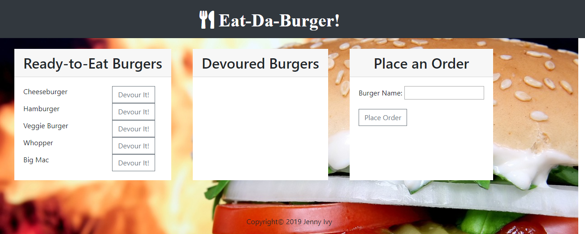

# Eat-da-Burger!

###### About this app:

This app is a burger logger that uses MySQL, Node, Express, Handlebars and a homemade ORM (yum!). It follows the MVC design pattern and uses Node and MySQL to query and route data in the app, and Handlebars to generate the HTML. 

View a live demo here: 

(See screenshot below):

